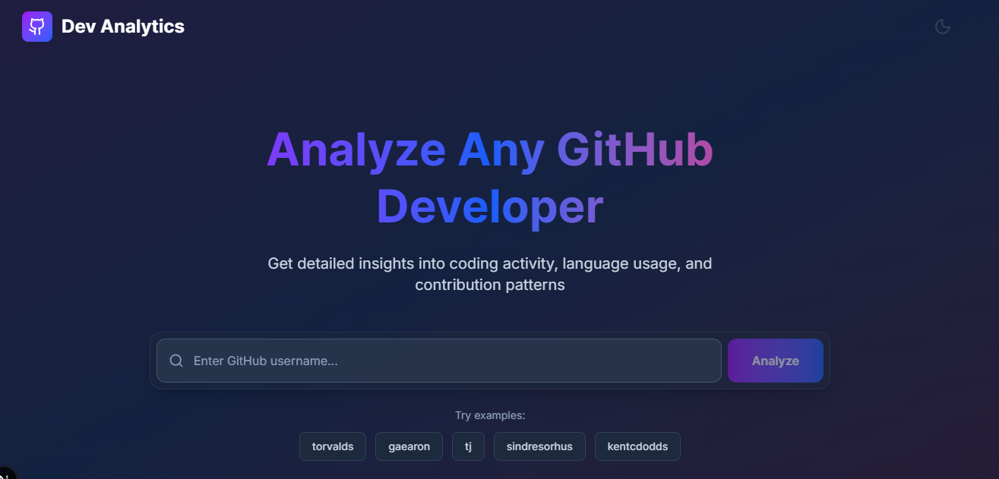
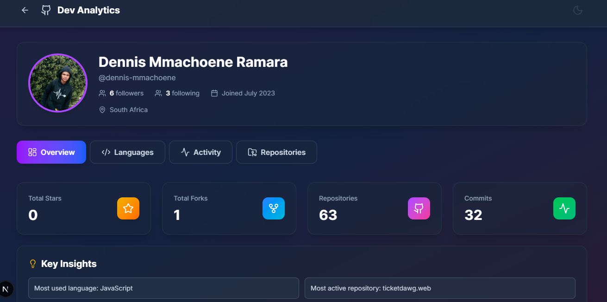

# Dev Analytics Dashboard

**Developer Portfolio Analytics Dashboard** built with Next.js 16, TypeScript, Tailwind CSS, and Recharts. Analyze any GitHub developer's profile with detailed insights into coding activity, language usage, and contribution patterns.

[](https://dev-analytics-dashboard-dk1z.vercel.app/)







## Features

- **Real GitHub Data Integration** - Fetches live data from GitHub REST API
- **Interactive Visualizations** - Beautiful charts using Recharts
- **Four Analytics Views**:
  - Overview - Key stats, top languages, and repositories
  - Languages - Detailed language distribution and statistics
  - Activity - Commit timelines and repository activity
  - Repositories - Sortable repository list with details
- **Modern UI/UX** - Glassmorphism design with smooth animations
- **Responsive Design** - Mobile-first, works on all devices
- **Server-Side Caching** - Optimized performance with smart caching
- **Rate Limit Handling** - Graceful handling of GitHub API limits
- **Type-Safe** - Full TypeScript support
- **Tested** - Unit tests with Jest
- **CI/CD Ready** - GitHub Actions workflow included

##  Tech Stack

- **Framework**: Next.js 16 (App Router)
- **Language**: TypeScript
- **Styling**: Tailwind CSS
- **Charts**: Recharts
- **Icons**: Lucide React
- **HTTP Client**: Axios
- **Testing**: Jest + React Testing Library
- **CI/CD**: GitHub Actions
- **Deployment**: Vercel (recommended)

## Prerequisites

- Node.js 18.x or higher
- npm or pnpm
- GitHub account (for PAT - optional but recommended)

## Getting Started

### 1. Clone the Repository

```bash
git clone https://github.com/dennis-mmachoene/dev-analytics-dashboard.git
cd dev-analytics-dashboard
```

### 2. Install Dependencies

```bash
npm install
# or
pnpm install
```

### 3. Set Up Environment Variables

Create a `.env.local` file in the root directory:

```bash
cp .env.example .env.local
```

Edit `.env.local` and add your GitHub Personal Access Token (optional but recommended to avoid rate limits):

```env
GITHUB_PAT=ghp_your_token_here
NEXT_PUBLIC_APP_TITLE=Dev Analytics Dashboard
```

### 4. Run Development Server

```bash
npm run dev
# or
pnpm dev
```

Open [http://localhost:3000](http://localhost:3000) in your browser.

## GitHub Personal Access Token (PAT)

To avoid GitHub API rate limits, create a Personal Access Token:

### Steps to Create a PAT:

1. Go to [GitHub Settings > Developer Settings > Personal Access Tokens > Tokens (classic)](https://github.com/settings/tokens)
2. Click **"Generate new token (classic)"**
3. Give it a descriptive name (e.g., "Dev Analytics Dashboard")
4. Select scopes:
   - `public_repo` (for public repositories only)
   - `repo` (if you want to access private repositories)
5. Click **"Generate token"**
6. Copy the token and add it to your `.env.local` file

**Without a PAT**: 60 requests per hour per IP address
**With a PAT**: 5,000 requests per hour

## Project Structure

```
dev-analytics-dashboard/
├── app/
│   ├── layout.tsx                    # Root layout
│   ├── page.tsx                      # Landing page
│   ├── globals.css                   # Global styles
│   ├── profile/[username]/
│   │   ├── layout.tsx               # Profile layout
│   │   ├── page.tsx                 # Overview tab
│   │   ├── languages/page.tsx       # Languages tab
│   │   ├── activity/page.tsx        # Activity tab
│   │   └── repositories/page.tsx    # Repositories tab
│   └── api/
│       └── github/route.ts          # GitHub API proxy
├── components/
│   ├── ProfileHeader.tsx            # User profile header
│   ├── StatsCards.tsx               # Statistics cards
│   ├── TabNavigation.tsx            # Tab navigation
│   ├── ThemeToggle.tsx              # Dark/light theme toggle
│   ├── Loading.tsx                  # Loading component
│   ├── ui/
│   │   └── GlassCard.tsx           # Glassmorphism card
│   └── charts/
│       ├── CommitsLineChart.tsx    # Commit activity chart
│       ├── LanguagesDonut.tsx      # Language distribution chart
│       └── RepoCommitsBar.tsx      # Repository commits chart
├── lib/
│   ├── github.ts                    # GitHub API client
│   ├── analytics.ts                 # Data processing & analytics
│   └── __tests__/
│       └── analytics.test.ts       # Unit tests
├── types/
│   └── github.ts                    # TypeScript types
├── .github/
│   └── workflows/
│       └── ci.yml                   # GitHub Actions CI
├── .env.example                     # Environment variables template
├── jest.config.js                   # Jest configuration
├── jest.setup.js                    # Jest setup
├── tailwind.config.ts              # Tailwind configuration
├── tsconfig.json                    # TypeScript configuration
└── README.md                        # This file
```

## Building for Production

```bash
npm run build
npm start
```

## Deployment

### Deploy to Vercel (Recommended)

1. Push your code to GitHub
2. Go to [Vercel](https://vercel.com)
3. Click **"New Project"**
4. Import your GitHub repository
5. Add environment variables:
   - `GITHUB_PAT`: Your GitHub Personal Access Token
6. Click **"Deploy"**

### Environment Variables on Vercel

In your Vercel project settings, add:

```
GITHUB_PAT=ghp_your_token_here
```

### Deploy to Other Platforms

The app can be deployed to any platform that supports Next.js:
- **Netlify**: Use `next build` and `next start`
- **Railway**: Connect your GitHub repo
- **AWS Amplify**: Deploy from your repository
- **Self-hosted**: Use Docker or PM2

## API Rate Limits

### Without GitHub PAT
- 60 requests/hour per IP
- Suitable for testing only

### With GitHub PAT
- 5,000 requests/hour
- Recommended for production

The app implements smart caching to minimize API calls:
- User profiles: cached for 1 hour
- Repositories: cached for 1 hour
- Analytics data: cached for 1 hour

## Customization

### Theme Colors

Edit `tailwind.config.ts` to customize colors:

```typescript
theme: {
  extend: {
    colors: {
      primary: '#7c3aed',
      secondary: '#3b82f6',
    }
  }
}
```

### Analytics Processing

Modify `lib/analytics.ts` to add custom analytics logic.

### API Endpoints

Add new endpoints in `app/api/github/route.ts`.

## Troubleshooting

### Rate Limit Errors

**Problem**: Getting 403 errors from GitHub API

**Solution**: Add a GitHub Personal Access Token to `.env.local`

### Build Errors

**Problem**: Build fails with TypeScript errors

**Solution**: Run `npm run type-check` to see detailed errors

### Missing Data

**Problem**: User data not loading

**Solution**: 
- Check if the username exists on GitHub
- Verify your internet connection
- Check browser console for errors

## License

MIT License - feel free to use this project for your portfolio!

## Contributing

Contributions are welcome! Please:

1. Fork the repository
2. Create a feature branch
3. Make your changes
4. Add tests
5. Submit a pull request

## Contact

Questions or feedback? Open an issue on GitHub!

## Acknowledgments

- GitHub REST API for data
- Recharts for beautiful visualizations
- Next.js team for an amazing framework
- Tailwind CSS for rapid styling
- All open-source contributors

---

**Built with ❤️ using Next.js, TypeScript, and Tailwind CSS**